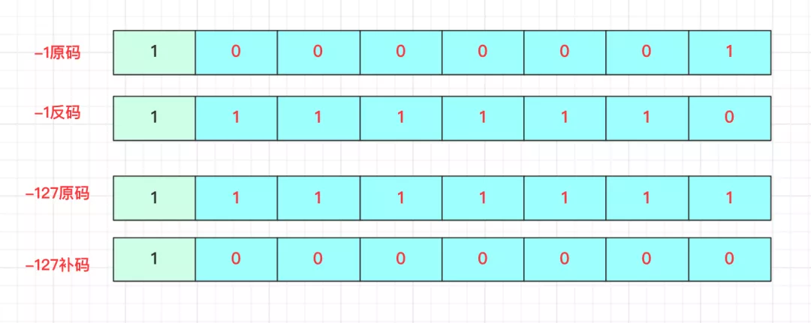
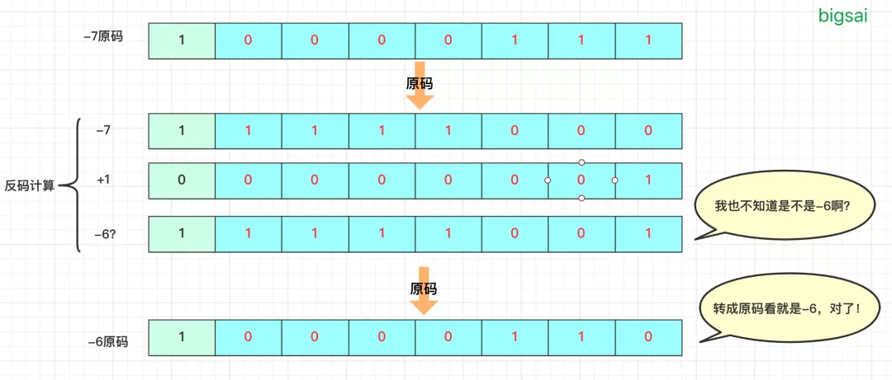
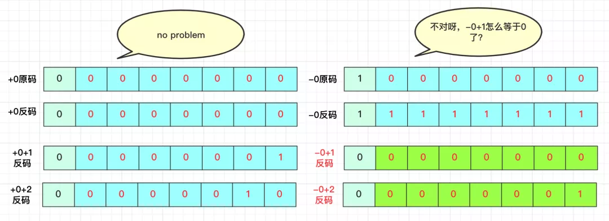
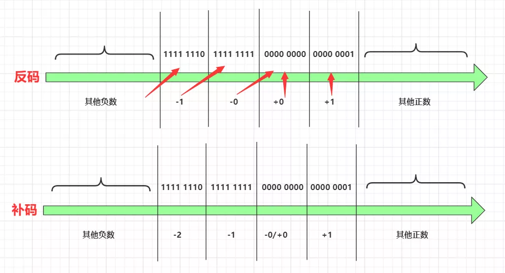
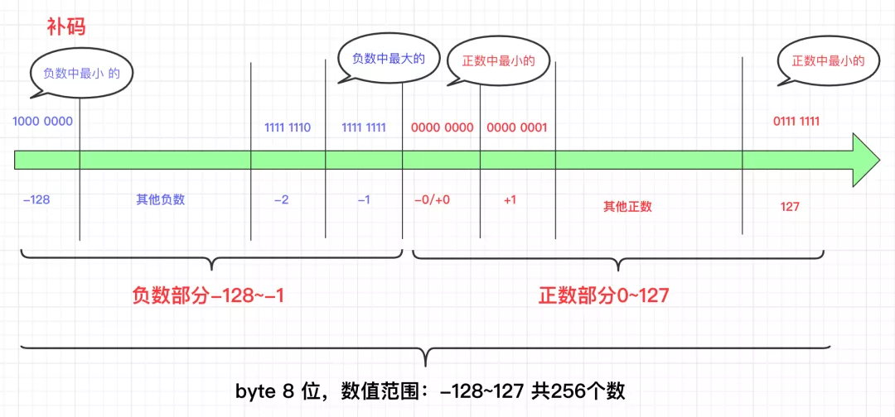

# 二进制

js中的二进制，主要使用`Number.toString(radix)`，其中的`radix`表示要转换成多的进制数，默认值为`10`。
有`ES6`中通过添加`0b`后面添加一系列二进制的数字（0或1），来表示一个二进制数。js中最高位用于表示符号：0为正，1为负

## 原码、补码、反码

这些知识点，我在有限的脑海里应该是在本科学习《计算机组成原理》时学到的东西。

前提：为了简化问题，二进制都是用一个字节，即8个二进制数来表示。

### 原码

先来说一说真值，表示自然数（正数、负数、0）以 +1 和 -1用二进制表示

```shell
+ 00000001 # +1
- 00000001 # -1
```

8位二进制能表示的范围为`[-2 ^ 8, +2 ^ 8]`

由于计算机的二进制只能用0和1进行表示，无法表示正负。所以就有了如下的规矩：取**首位**为符号为`0`表示为正；`1`表示为负，剩下的七位表示真值的绝对值。这种方法叫 `原码表示法`。上面的例子 +1和-1表示如下 :

```shell
0 0000001 # +1
1 0000001 # -1
```

思考一下，那`100000000` 表示什么？ `-0`。但是`-0`这个值是没有意义的。 所以规定 `10000000` 用来表示`-128`,这样算下来负数就比正数多了一位，所以二进制的表示范围：[-2 ^7, +2 ^ 7 - 1]

### 反码

反码是另一种表示数字的方法，规定如下：**符号位保持不变，正数的反码就是本身，负数的反码，其余各值取按位反**。例子如下：

`00000101` 反码 `01111010`

但是为什么会出现反码这个东西呢？正常的计算机只能计算加法，但是遇到负数的时候怎么办？

负数的反码变成了正值，这样就能通过反码把两个负数的运算转换为加法。从而简化问题。引用网上的例子如下（-1 + -2）：



取负数的反码之后进行运算



## 补码

思考一个问题，负数与负数的运算可以解决了，正数与负数的运算也可以正常运算了。但是还有一个问题：在原码中有+0， -0这两个特殊的值，可以在反码中正常运算吗？



从上面的运算结果来看，反码解决不了这个问题。于是就引出来的补码。
先来看下补码的定义：**符号位保持不变，正数的原码与补码一样，负数的补码，其余按位取反，最后末尾+1（即反码末尾+1）**。让我们来看下补码后的所有数：



OK，解决了-0和+0的问题。所有运算都可以转换成为补码进行运算了.
最后总结下补码的表示区间。



总结一下：

1. 原码：能够直接表示数值的大小情况，也是人最容易能理解的一类计算表示数。首位为符号位：0代码正、1代表负
2. 反码：是一个过渡码，正数的反码就是本身，负数的反码为：符号为保持不变，其余按位取反
3. 补码：是计算机中存储数值的形式，解决了负数加法的问题，使得符号位直接参与运算。

注：在一些位运算的题中要注意数范围是否有符号数，在js中可以用`>>>0`的方式，把一个数值转换为无符号为的形式。

### 进制转换

- 十进制转换为k进制。主要通过，除以 k ，右侧为余数，最终的结果为：从下到上，高位到低位进行转换。如下图：


- 二进制转换为十进制

101转换为十进制：从右往左进行实现(^表示次方的意思)

1 x 2 ^ 0 = 1

0 x 2 ^ 1 = 0

1 x 2 ^ 2 = 4

-----------------
即：4 + 1  = 5
## js中的位运算符号

- `|` 或

> `|` 逻辑或运算：
>
> 1. 如果都为0，则返回0
> 2. 运算中两位数其中有一个为1，则为1

```shell
    101
    001
=   101 
console.log((0b101 | 0b001).toString(2)); # 101
```

- `&` 与

`&`运算的规律如下：如果都为1则为1，运算中有一个为0，则为0

``` shell
    101
    001
=   001

(0b101 & 0b011).toString(2) # 1
```

- `^` 异或

异或，就是比较两个数是否相同，相同则为0，不同则为1

```shell

    101
    001
=   100

(0b101 ^ 0b001).toString(2) # 100
```

总结： `^`和`|`都可以用于把一个二进制第i位数字还原到对应的位置中去

- `~` 非

·~·运算符，则会对每一位进行取反，1变为0， 0变为1

```shell
    101
=   010

(~0b101).toString(2) # -110
# 这里返回的结果为 -110,是因为最高为符号默认为 0，取反后为1，就变成了负数
```

### 位置移动类

- `<<` 左移

`1 << i`,表示把一个二进制数的第`i`位值

`t |= 1 << i`表示的意思是把第i位的二进制值还到数字t的第i位中

左移：就是每一位都向左移动一位，尾数补0，基效果相当于x2，其实计算机就是使用移位来进行乘法计算的。

```ts
(0b010 << 1).toString(2) // 100
```


- `>>` 右移（有符号右移）

右移：向右移动 n 位，右边的值被丢弃。左边空位值使用符号位的数值进行补充

常见操作 `n >> i` 这个操作是用于在n的二进制中取第i位的值从左到右。即 `(n >> i) & 1`可以判断当前为是 1还是0

- `>>>` 逻辑右移（无符号右移）

> 该运算符将第一个操作数向右移动指定的位数。向右移动的多余位将被丢弃。零位从左侧移入。其符号位变为 0，因此其表示的结果始终为非负数。与其他按位运算符不同，零填充右移返回无符号 32 位整数。


## 技巧

- js中使用`toString(2)` 把一个数转换为指定进制数
- 移除二进制数中右侧的最后一个`1` n & (n-1)
- 获取最后一个`1`也叫LowBit，有两个公式
  - x & -x
  - n &(n ^ (n - 1))

- 使用位运算来判断一个数字是奇数还是偶数，注意是 `==`并不是严格等于。
  
> `i & 1 == 1` 为奇数
>
> `i & 1 == 0` 为偶数
>
> 因为在二进制中奇数的最后一位肯定不是0，一个数 `%2`有余数才为奇数。而十进制转换为二进制的过程最后的试算正是用的%2的余数

## 参考

1. <https://www.cnblogs.com/zhangziqiu/archive/2011/03/30/computercode.html>
2. <http://graphics.stanford.edu/~seander/bithacks.html#OperationCounting>
3. <https://www.51cto.com/article/663685.html>
4. <https://xiaochen1024.com/courseware/60b4f11ab1aa91002eb53b18/6196420ac1553b002e57bf19>
5. <https://developer.aliyun.com/article/841237>
6. <https://yanhaijing.com/javascript/2016/07/20/binary-in-js/>
7. <https://segmentfault.com/a/1190000038208382>
8. <https://www.cnblogs.com/fusiwei/p/11752540.html>
9. <https://developer.mozilla.org/zh-CN/docs/Web/JavaScript/Reference/Operators>
10. <https://blog.michealwayne.cn/2019/10/29/notes/js%E4%B8%AD%E4%BD%8D%E8%BF%90%E7%AE%97%E7%9A%84%E9%AA%9A%E6%93%8D%E4%BD%9C/>